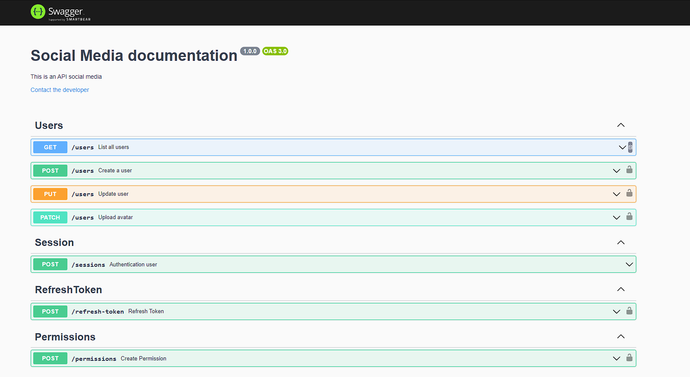

# Nome do Projeto

Rede Social JDG - Back-end 🚀

## Descrição

Este projeto é o back-end da Rede Social JDG, uma aplicação desenvolvida em Node.js utilizando as melhores práticas de desenvolvimento. A Rede Social JDG permite aos usuários criar perfis, fazer postagens e interagir por meio de comentários.

## Tecnologias Utilizadas 👨‍💻

- Node.js
- TypeScript
- Express
- JWT (JSON Web Tokens)
- Postgres
- Jest
- Swagger
- Docker 

## Funcionalidades 👨🏿‍💻

- Autenticação de usuários utilizando JWT.
- Controle de permissões e gerenciamento de rotas.
- Criação e gerenciamento de perfis de usuário.
- Criação e gerenciamento de postagens.
- Comentar em postagens.

## Configuração ⚙️

1. Clone o repositório para o seu ambiente local.
2. Instale as dependências utilizando o comando `npm install`.
3. Configure as variáveis de ambiente no arquivo `.env`, seguindo o exemplo do arquivo `.env.example`.
4. Execute o comando `docker-compose up -d`
5. Acesse a API em `http://localhost:3333`.

## Testes 🔧

Os testes automatizados foram implementados utilizando o Jest. Para executar os testes, utilize o comando `npm run test`.

## Documentação da API 📑

A documentação da API pode ser encontrada em `http://localhost:3333/api-docs`, utilizando o Swagger.

## Contribuição 💯

Contribuições são bem-vindas! Sinta-se à vontade para abrir uma issue relatando algum problema ou sugerindo melhorias. Se preferir, você também pode abrir um pull request.

## Contato 📞

Se você tiver alguma dúvida ou sugestão relacionada a este projeto, entre em contato com Romário Alves via romario.desenvolvedor@gmail.com.
